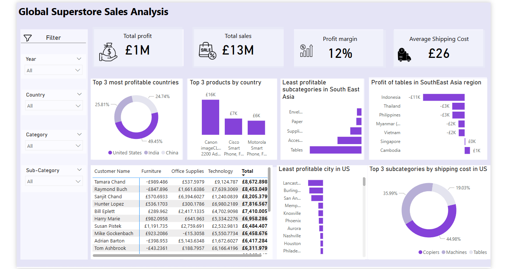

# Global-Superstore-Sales-Analysis

## Project Overview
The Global Superstore is a multinational e-commerce retailer offering a wide variety of Office Supplies, Furniture, and Technology products across 147 countries. The primary objective was to extract insights that would inform strategic decisions and improve profitability.

This project leverages Power BI to clean, model, and visualize data,  delivering key business insights such as top-performing products, regions, and categories

## Objectives
- Identify top-performing countries, products, and categories.
- Analyze profitability by region, subcategory, and shipping cost
- Uncover factors affecting poor performance in specific markets like Nigeria and Southeast Asia.
- Recommend data-driven strategies for performance and profitabilty.

## Key Metrics
  
-  Total Profit
-  Total Sales
-  Profit Margin (%)
-  Average Discount
-  Average Shipping Cost
-  Average Profit Per Order
-  Total Quantity Sold
-  Most Valuable Customer

## Skills Demonstrated
  
- Data Cleaning & Transformation
- Data Modelling
- Data Analysis
- Data Visualization

## Visualization

## You can interact with the Dashboard [HERE](https://app.powerbi.com/groups/me/reports/166998cd-2124-41f1-b3a8-3387e4f98234/8b842dc3b72bfcff0c01?experience=power-bi)

## Analysis & Findings

### Top 3 Most Profitable Countries in 2014:

- United States with a total profit of €93K,
- India with a total profit of €48K
- And China with a total profit of €46K

### Nigeria’s Performance in 2014 Compared to other African Countries:

- Nigeria is among the lowest in Africa with a sum profit of €-23k. Findings on this revealed high shipping costs and high discount rate as root cause

### Least Profitable Subcategory Product in Southeast Asia: 

- Tables are the least profitable products, especially in Indonesia generating a sum profit of €-10.6k

### Least Profitable US City: 

- Lancaster due to high shipping cost and excessive discounts

### Australia’s Most Profitable Subcategory: 

- Appliances with an average profit of €139

### Most Valuable Customers: 

- Customers purchasing technology products

## Recommendations
Here are some strategic recommendations for the Global Superstore team to enhance performance and profitability across key markets:

- Low-profit countries like Nigeria can partner with local logistics providers to reduce delivery overhead.
- Consider removing or replacing the table products in the Southeast Asia regions where profit is low or conduct localized market research to adjust the product fit.
- Phones, Copiers, and bookcase generated the highest profits across top-performing countries, Allocate more marketing and inventory budget to these product sub-categories, especially in countries like the US, China and India.
- Launch a loyalty or premium service program to retain most valuable customers and upsell technology products.

### Data Source: Provided by Digitaley Drive

